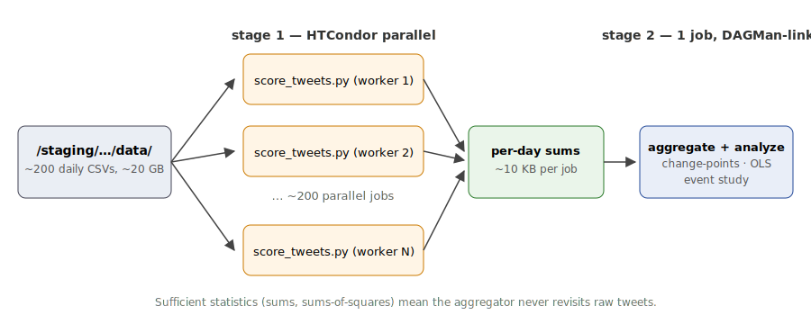
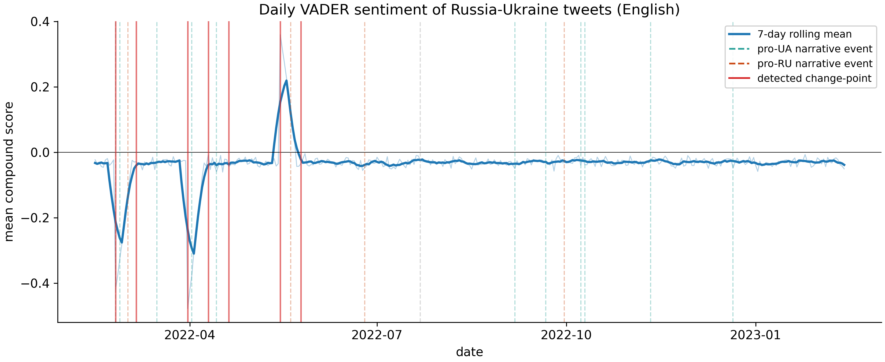
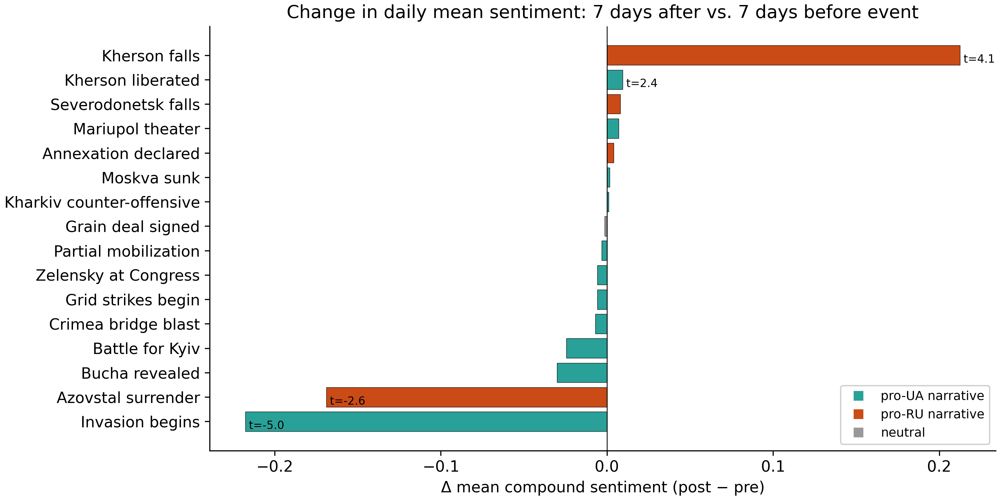
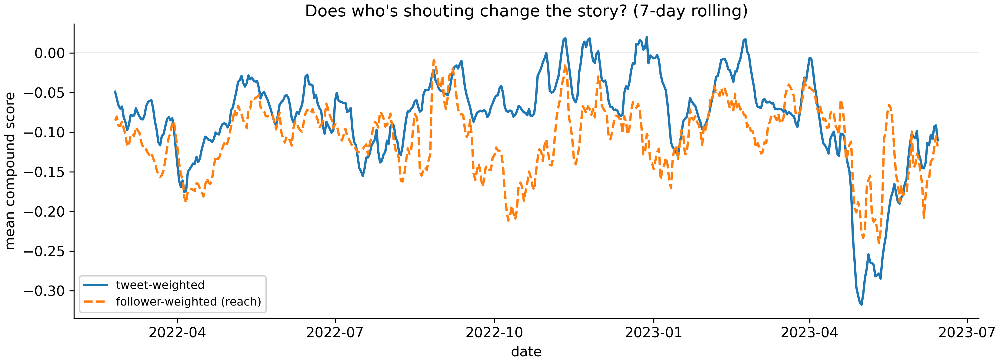

## The question {.center}

::: {style="font-size:1.5em; line-height:1.4;"}
When a major Russia-Ukraine war event hits the wire, **does the
sentiment of public tweets shift, and for how long?**
:::

::: {style="margin-top:1.5em; color:#666;"}
We score ~52 GB of tweets (70.9M tweets, 476 days) with VADER on
the CHTC cluster, then run event-study regressions and change-point
detection against a curated timeline of 21 major war events.
:::

---

## The data

-   **Kaggle**: `bwandowando/ukraine-russian-crisis-twitter-dataset-1-2-m-rows`
-   ~480 daily CSVs, packed into 39 multi-day chunks on CHTC
-   **~52 GB total**, Feb 2022 to mid-2024
-   After scoring: **70,876,101 tweets across 476 days**
-   Columns used: `text`, `tweetcreatedts`, `language`,
    `retweetcount`, `followers`

::: {.fragment}
**One line of code to read one file:**

```python
tweets = pd.read_csv("0819_UkraineCombinedTweetsDeduped.csv")
```
:::

---

## Parallel computation on CHTC

{width=65%}

::: {style="font-size:0.65em;"}
-   **Stage 1**: 39 HTCondor jobs in parallel (one per chunk), Apptainer container from `/staging`
-   **Stage 2**: single DAGMan-linked aggregator
-   **Wall-clock**: ~1h40min end to end (calibration chunk: 7 min; largest chunks: ~50 min)
-   [Raw tweets never leave `/staging`; `learn` stays clean.]{style="color:#c33;"}
:::

---

## Method

**VADER compound score** per tweet (-1 = very negative, +1 = very positive)

Each file produces per-(date, language) sums: `sum(compound)`,
`sum(compound^2)`, `sum(followers*compound)`, counts. These let the
aggregator compute daily means, variances, and reach-weighting without
re-reading the raw tweets.

Three analyses on the daily time series:

1.  **Event study**: Welch's *t* on mean sentiment in a [-7, +7] day
    window around each of 21 events (16 with complete windows).
2.  **PELT change-point detection** on daily mean compound.
3.  **OLS regression**: `mean_compound ~ t + log(n_tweets) + event dummies`.

---

## Result 1: sentiment timeline

{width=85%}

::: {style="font-size:0.55em; color:#666;"}
Blue = 7-day rolling mean (English); dashed = annotated events; red = PELT change-points. Daily mean drifts around -0.05 to -0.10; deepest dips around Bucha (Apr 2022) and Bakhmut (spring 2023).
:::

---

## Result 2: event study

{width=80%}

::: {style="font-size:0.55em; color:#666;"}
3 of 16 events pass |t| > 2: **Kharkiv counter-offensive** (+0.036, t=2.65), **Annexation declared** (+0.023, t=2.41), **Bucha revealed** (-0.076, t=-2.25).
:::

---

## Result 3: regression + change-points

::: {style="font-size:0.7em;"}
**OLS (n=476)**: *R*^2 = 0.092, adj = 0.054, F = 2.44, *p* = 0.0007. Coefficients with |t| > 2:

| Event | beta | p |
|---|:-:|:-:|
| Kherson liberated | **+0.119** | 0.006 |
| Kakhovka dam | **-0.108** | 0.019 |
| War anniversary | +0.092 | 0.036 |
| Zelensky at Congress | +0.089 | 0.040 |

**PELT** finds 21 structural breaks; only 2022-12-21 (Zelensky at Congress) aligns with a labeled event.
:::

---

## Result 4: reach weighting

{width=85%}

::: {style="font-size:0.55em; color:#666;"}
Follower-weighting shifts amplitude, not sign: loudest accounts mirror the median tweeter.
:::

---

## Takeaways + limitations

::: {style="font-size:0.72em;"}
**Found**: events explain ~9% of daily variance. Kherson + Kakhovka register with the expected sign in the regression; Bucha is the clearest single-event dip. Most change-points don't match our event list.

**Caveats**: VADER is English-only (non-English looks muted); Durbin-Watson 0.70 means strong autocorrelation (OLS SEs understated); events cluster, so dummies are not clean causal effects; no bot filter.

**Next**: multilingual sentiment (XLM-R), bot filter, RDD around each event.
:::

::: {style="margin-top:0.8em; font-size:0.55em; color:#666;"}
`git clone https://github.com/matteso1/STAT405project.git`
:::
