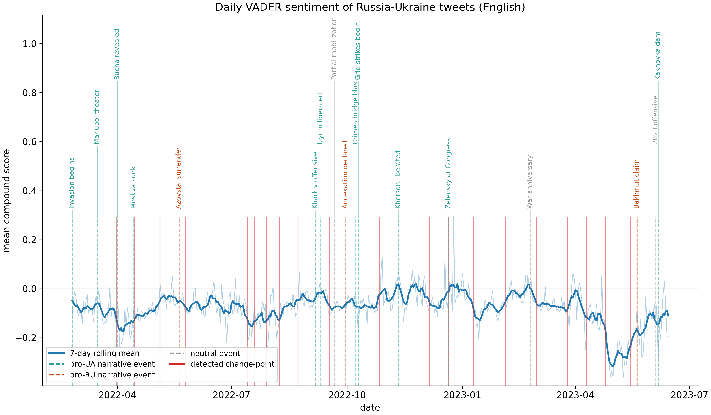
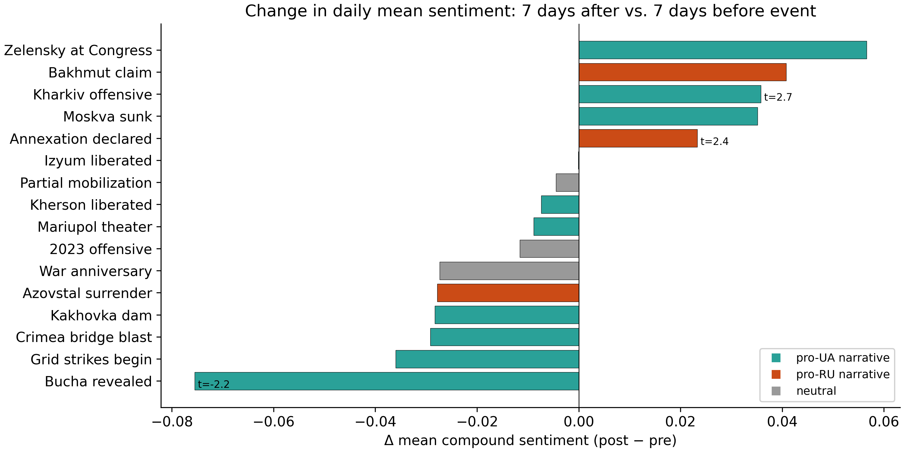

## Introduction

We ask whether public tweet sentiment shifts when a major
Russia-Ukraine war event happens. We scored **70.9 million
tweets** (~52 GB) from the Kaggle
`bwandowando/ukraine-russian-crisis-twitter-dataset` on CHTC with
HTCondor, then ran three analyses against 21 curated events:
Welch *t*-tests, PELT change-point detection, and OLS regression
on event dummies with controls. The model explains ~9% of daily
variance (*R*² = 0.09, *F* = 2.4, *p* = 0.0007); strongest
effects are **Kherson liberated** (*β* = +0.12, *p* = 0.006) and
**Kakhovka dam** (*β* = -0.11, *p* = 0.02). PELT flags 21 breaks;
only one matches a labeled event.

## Data, computation, results

**Data.** 480 daily CSVs (~52 GB), Feb 2022 to June 2023. Columns:
`text`, `tweetcreatedts`, `language`, `retweetcount`, `followers`.
Rows with empty text or bad timestamps dropped (<2%). After
scoring: 70,876,101 tweets across 476 days. Primary results pool
English because VADER is English-trained.

**Computation.** An Apptainer container (pandas + vaderSentiment,
~340 MB) was staged to `/staging/nomatteson/`. Because `/staging`
caps users at 100 inodes, we packed the CSVs into 39 multi-day
chunks. For each chunk, `score_tweets.py` streams the file in
200k-row blocks, runs VADER per tweet, and emits one row per
(date, language) with sums of compound, compound², pos/neg/neu,
followers, and followers×compound — sufficient statistics, so the
aggregator never re-reads raw tweets. **Per job:** 1 CPU, ~1.2 GB
RAM, 8 GB disk. Calibration chunk (419 MB) ran in 7 min; largest
chunks (~3.2 GB) took ~50 min. **Total:** 39 parallel jobs,
~1h40min wall-clock. Raw tweets never left `/staging`.

**Results.**

{width=100%}

English daily mean compound sentiment drifts between -0.05 and
-0.15, with shorter negative dips around Bucha (April 2022) and
the deepest excursion during the Bakhmut period (spring 2023). Of
the 16 events with full [-7, +7] windows, three pass |*t*| > 2:
Kharkiv counteroffensive (+0.04, *t* = 2.7), annexation declared
(+0.02, *t* = 2.4), and Bucha revealed (-0.08, *t* = -2.2).

{width=100%}

The OLS regression
(`mean_compound ~ t + log(n_tweets) + 17 event dummies`, *n* = 476)
gives *R*² = 0.09, *F* = 2.4 (*p* = 0.0007). Four coefficients
clear |*t*| > 2: Kherson liberated (*β* = +0.12, *p* = 0.006),
Kakhovka dam (*β* = -0.11, *p* = 0.02), anniversary (+0.09,
*p* = 0.04), Zelensky at Congress (+0.09, *p* = 0.04). PELT flags
21 breaks; only 2022-12-21 (Zelensky at Congress) aligns with a
labeled event. Reach-weighting by follower count shifts amplitude
but not sign.

**Weaknesses.** (i) VADER is English-only; non-English tweets
look falsely neutral. (ii) Twitter users are not the public.
(iii) Durbin-Watson = 0.70 means autocorrelation understates OLS
standard errors. (iv) Events cluster, so dummies aren't causal.
(v) No bot filter.

## Conclusion

War events explain ~9% of daily variance on English Twitter, but
a handful register: Kherson's liberation and the Kakhovka dam
cross |*t*| > 2 with expected sign, and Bucha is the clearest
single-event dip. Most change-points don't match labeled events —
either unlabeled drivers or VADER tracking vocabulary drift.
Future work: multilingual sentiment (XLM-R), a bot filter, and
regression-discontinuity around each event.

### Contributions

| Member | Proposal | Coding | Presentation | Report |
|---|:-:|:-:|:-:|:-:|
| Calvin Sharpe | | | | |
| Nils Matteson | 1 | 1 | 1 | 1 |
| Pravin Schmidley | | | | |
| Will Tappa | | | | |
| Yash Rajani | | | | |

*1 = full, 0.1-0.9 = partial, 0 = none.*

Clone: `git clone https://github.com/matteso1/STAT405project.git`
